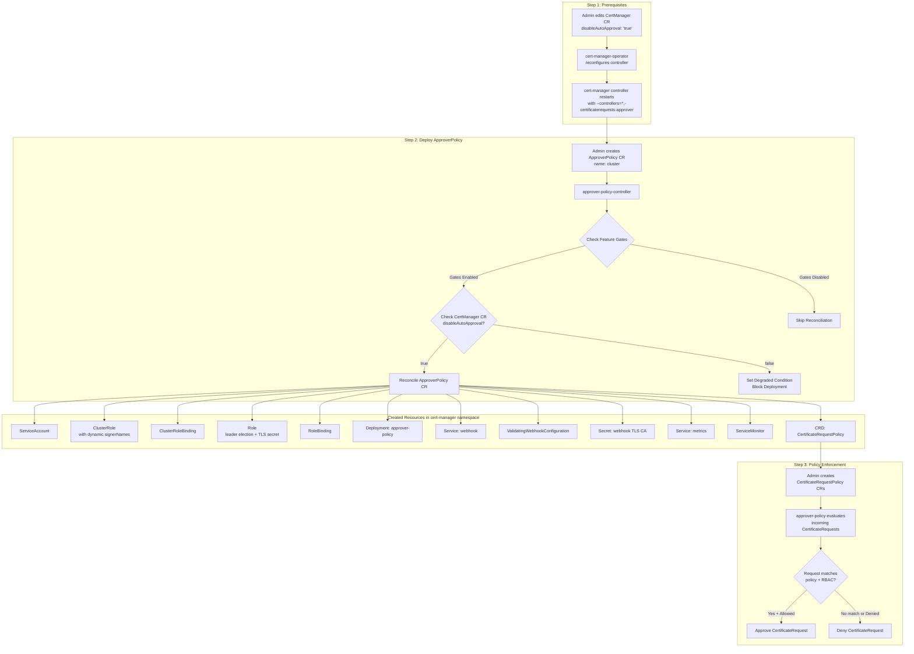

# Extend cert-manager-operator to manage approver-policy

## Summary

This enhancement describes the proposal to extend `cert-manager-operator` to deploy and manage the
[approver-policy](https://github.com/cert-manager/approver-policy) operand with a dedicated controller.
approver-policy is a CertificateRequest approver for cert-manager that enables fine-grained policy control
over which certificate requests are approved or denied based on `CertificateRequestPolicy` resources.

approver-policy will be managed as an operand by an additional controller in cert-manager-operator. The operand
will be installed in the `cert-manager` namespace. When deployed, it replaces cert-manager's built-in
CertificateRequest approver with a policy-driven approval workflow, enabling administrators to define
granular policies governing certificate issuance.

**Critical Prerequisite:** The cert-manager built-in auto-approver **must** be disabled before installing
approver-policy. If both approvers are active simultaneously, they will race and policy enforcement will be
ineffective. This enhancement introduces a `disableAutoApproval` field on the `CertManager` CR to provide
this capability.

**Note:**
Throughout the document, the following terminology means:
- `approver-policy` is the operand managed by the cert-manager operator.
- `approver-policy-controller` is the dedicated controller in cert-manager operator managing the `approver-policy` operand deployment.
- `approverpolicies.operator.openshift.io` is the custom resource for interacting with `approver-policy-controller` to install,
  configure, and uninstall the `approver-policy` operand deployment.
- `CertificateRequestPolicy` is the upstream CRD (from `policy.cert-manager.io` API group) that defines approval policies.

## Motivation

Certificate policy enforcement is critical for enterprise security. Without approver-policy, cert-manager
automatically approves all CertificateRequests, meaning any user with permission to create a CertificateRequest
can obtain any certificate from any configured issuer. This is unacceptable in production environments where
certificate issuance must follow organizational policies.

approver-policy solves this by:

1. **Policy-Based Approval**: Define `CertificateRequestPolicy` resources that specify what attributes (DNS names,
   IP addresses, key algorithms, durations, etc.) are allowed or required in certificate requests.
2. **RBAC Integration**: Policies are bound to users/groups via standard Kubernetes RBAC, so only authorized
   requestors can use specific policies.
3. **Issuer Scoping**: Policies can be scoped to specific issuers (by name, kind, and group), ensuring that
   only authorized issuers are used for certain types of certificates.
4. **Namespace Scoping**: Policies can target specific namespaces by name or label selector.
5. **CEL Validation**: Advanced validation rules using Common Expression Language (CEL) for fine-grained
   attribute validation beyond simple allow-lists.

The `cert-manager-operator` already manages `cert-manager`, `istio-csr`, and `trust-manager`. Extending it
to manage `approver-policy` provides a unified, operator-managed solution for certificate lifecycle
management, trust distribution, and policy enforcement on OpenShift.

### User Stories

- As an OpenShift administrator, I want to have an option to deploy approver-policy as a day-2 operation, so
  that I can enforce certificate issuance policies across my cluster.
- As an OpenShift administrator, I want to disable the built-in cert-manager auto-approver in a controlled
  manner before enabling approver-policy, to avoid racing conditions between approvers.
- As an OpenShift administrator, I want to be able to configure which signer names approver-policy can
  approve or deny, so that I can integrate with external issuers.
- As an OpenShift security engineer, I want to define policies that restrict certificate attributes (DNS names,
  key sizes, durations, etc.) that can be requested, to enforce organizational security standards.
- As an OpenShift security engineer, I want to use RBAC to control which users and service accounts can
  request certificates matching specific policies.
- As an OpenShift administrator, I should be able to uninstall approver-policy when not required as a day-2
  operation without disrupting the cert-manager installation.
- As an OpenShift security engineer, I want to be able to identify all artifacts created by approver-policy
  for better auditability.
- As an OpenShift SRE, I should be able to get detailed information as part of different status conditions and
  messages to identify reasons for failures.
- As an OpenShift SRE, I should be able to collect metrics for approver-policy for monitoring.

### Goals

- `cert-manager-operator` to be extended to manage `approver-policy` along with currently managed `cert-manager`,
  `istio-csr`, and `trust-manager`.
- New custom resource (CR) `approverpolicies.operator.openshift.io` to be made available to install and
  configure the approver-policy deployment.
- New field `disableAutoApproval` on the existing `CertManager` CR to safely disable the built-in
  CertificateRequest approver before deploying approver-policy.
- approver-policy operand will always be deployed in the `cert-manager` namespace.
- The `CertificateRequestPolicy` CRD from upstream (`policy.cert-manager.io`) will be installed as part of
  the operand deployment.
- Support configurable signer names for approval scope.
- Dynamic RBAC configuration based on signer names.
- Release as TechPreview with dual feature gate mechanism (operator feature gate + OpenShift FeatureSet).

### Non-Goals

- Removing the `approverpolicies.operator.openshift.io` CR object will not remove the `approver-policy`
  deployment or its associated resources (ServiceAccount, RBAC, Services, etc.). Deleting the CR will only stop
  the reconciliation of the resources created for the operand installation. This limitation will be re-evaluated
  in future releases.
- Automatic cleanup of `CertificateRequestPolicy` resources created by users when the ApproverPolicy CR is deleted.
- Automatic re-enabling of the built-in cert-manager auto-approver when approver-policy is uninstalled. Users
  must manually re-enable auto-approval if needed.
- Managing or configuring the content of `CertificateRequestPolicy` resources. The operator only manages the
  approver-policy deployment; policy authoring is left to the cluster administrator.
- Plugin support for approver-policy. Only the built-in `allowed` and `constraints` evaluators will be available
  in the initial release.

## Proposal

### Design for Disabling the Default Approver

This is the most critical design decision in this enhancement. cert-manager ships with a built-in CertificateRequest
approver that automatically approves all requests. When approver-policy is deployed alongside this built-in approver,
**both will race to process CertificateRequests**, making policy enforcement ineffective.

Per the [upstream documentation](https://cert-manager.io/docs/policy/approval/approver-policy/installation/):

> ⚠️ If the default approver is not disabled in cert-manager, approver-policy will race with cert-manager
> and policy will be ineffective.

#### Design Choice: Explicit `disableAutoApproval` Field on CertManager CR

A new field `disableAutoApproval` will be added to the existing `CertManager` CR spec
(`certmanagers.operator.openshift.io`). This field gives users explicit, auditable control over disabling
the built-in approver.

**How it works:**
1. When `disableAutoApproval` is set to `"true"`, the operator injects `--controllers=*,-certificaterequests-approver`
   into the cert-manager controller deployment args. This disables only the built-in approver while keeping all
   other cert-manager controllers functional.
2. The cert-manager controller pod restarts with the updated args.
3. From this point, **no CertificateRequests will be auto-approved** — an external approver (like approver-policy)
   must be deployed to approve them.

**Why this design:**

| Alternative                                             | Pros                                                                                                          | Cons                                                                                                                     |
| ------------------------------------------------------- | ------------------------------------------------------------------------------------------------------------- | ------------------------------------------------------------------------------------------------------------------------ |
| **A) `disableAutoApproval` on CertManager CR** (chosen) | Explicit user control; auditable; decoupled from approver-policy lifecycle; prevents accidental policy bypass | Requires two-step process (disable auto-approval, then deploy approver-policy)                                           |
| **B) Auto-disable when ApproverPolicy CR created**      | One-step; automatic                                                                                           | Hidden side-effect; cross-resource dependency; hard to debug if cert-manager restarts unexpectedly; reversing is complex |
| **C) Use existing `overrideArgs`**                      | No API change needed                                                                                          | Poor UX; error-prone; not discoverable; hard to validate                                                                 |

Option A is chosen because:
- **Safety**: The two-step process ensures users understand the implications — disabling auto-approval
  stops all certificate issuance until an external approver is in place.
- **Explicitness**: The field is clearly documented and auditable in the CertManager CR.
- **Decoupling**: The cert-manager configuration is independent of the approver-policy lifecycle.
- **Reversibility**: Users can re-enable auto-approval by setting the field to `"false"` without needing
  to delete the approver-policy CR.

**Workflow:**
```
Step 1: Disable auto-approval
  oc patch certmanager cluster --type merge -p '{"spec":{"disableAutoApproval":"true"}}'
  → cert-manager controller restarts with --controllers=*,-certificaterequests-approver

Step 2: Deploy approver-policy
  oc apply -f approver-policy-cr.yaml
  → approver-policy-controller deploys the operand

Step 3: Create CertificateRequestPolicies
  oc apply -f my-policy.yaml
  → approver-policy evaluates future CertificateRequests against this policy
```

**Safety Enforcement in ApproverPolicy Controller:**

The `approver-policy-controller` will check the `CertManager` CR before deploying the operand:
- If `disableAutoApproval` is NOT `"true"`, the controller will set a `Degraded` condition on the
  `ApproverPolicy` CR with a message:
  `"The built-in cert-manager auto-approver is still enabled. Set .spec.disableAutoApproval to 'true' on the CertManager CR 'cluster' before deploying approver-policy. Without this, approver-policy will race with cert-manager and policy enforcement will be ineffective."`
- The controller will **not deploy** the approver-policy operand until auto-approval is disabled. This
  prevents the race condition entirely.

#### Preventing Re-enabling Auto-Approval (Two-Layer Defense)

A critical edge case is: **what happens if a user re-enables auto-approval after approver-policy is already
deployed?** If allowed, the built-in cert-manager approver would restart and race with approver-policy again,
silently bypassing all `CertificateRequestPolicy` rules. This is especially dangerous because there is no
visible error — CertificateRequests appear to work normally, but policies are being bypassed.

To prevent this, we implement a **two-layer defense**:

**Layer 1 — CEL Immutability Guard (Preventive):**

The `disableAutoApproval` field is made **immutable once set to `"true"`** using a CEL validation rule on the
CertManager CRD, following the same pattern as the existing `defaultNetworkPolicy` field:

```go
// +kubebuilder:validation:XValidation:rule="oldSelf != 'true' || self == 'true'",message="disableAutoApproval cannot be changed from 'true' to 'false' once set"
```

This means:
- The Kubernetes API server **rejects** any update that attempts to change `disableAutoApproval` from `"true"` to
  `"false"` or `""`. The race condition can never happen through a normal API update.
- If a user truly needs to re-enable auto-approval (e.g., after fully removing approver-policy and cleaning up
  all resources), they must **delete and recreate the CertManager CR**. This intentional friction prevents
  accidental security degradation.
- This is consistent with the existing `defaultNetworkPolicy` field which uses the same immutability pattern:
  `"defaultNetworkPolicy cannot be changed from 'true' to 'false' once set"`.

**Layer 2 — Continuous Validation in approver-policy-controller (Detective):**

As a defense-in-depth measure, the `approver-policy-controller` **continuously watches** the `CertManager` CR
during every reconciliation loop. Even with the CEL guard, there are edge cases where auto-approval could be
re-enabled (e.g., CertManager CR deleted and recreated without the field, or manual etcd manipulation):

- On each reconciliation, the controller checks `CertManager` CR's `disableAutoApproval` value.
- If `disableAutoApproval` is not `"true"`, the controller:
  1. Sets a `Degraded` condition on the `ApproverPolicy` CR:
     ```
     Type: Degraded
     Status: True
     Reason: AutoApprovalEnabled
     Message: "The built-in cert-manager auto-approver is enabled. Policy enforcement is
               ineffective — both approvers will race. Set .spec.disableAutoApproval to 'true'
               on CertManager CR 'cluster' to restore policy enforcement."
     ```
  2. Sets the `Ready` condition to `False` to clearly indicate the operand is not functioning correctly.
  3. The approver-policy deployment **remains running** (not torn down) but the status clearly indicates
     the problem, allowing the user to fix the CertManager CR without re-deploying.

This two-layer approach ensures:
- **Layer 1** prevents the common case (accidental API update) at the admission level — the race never starts.
- **Layer 2** detects uncommon cases (CR recreation, edge cases) and alerts the user immediately.
- Together, they provide both **prevention** and **detection** of the auto-approval race condition.

### Deploying approver-policy

`approver-policy` will be installed and managed by `cert-manager-operator`. A new custom resource is defined
to configure the `approver-policy` operand. The `approverpolicies.operator.openshift.io` CR can be added
day-2 to install `approver-policy` post the installation or upgrade of cert-manager operator on OpenShift
clusters.

Starting from cert-manager-operator v1.XX.0, approver-policy will be available as Tech Preview. The feature
requires both the operator's `ApproverPolicy` feature gate to be enabled AND the OpenShift cluster to be
configured with a TechPreview-compatible feature set (`TechPreviewNoUpgrade`, `DevPreviewNoUpgrade`, or
`CustomNoUpgrade`). On clusters with the default feature set, the approver-policy feature will not be
available.

The feature is supported on both OpenShift and MicroShift. Since MicroShift does not support OpenShift
FeatureSets, the FeatureSet gating is not enforced on MicroShift, and users can enable approver-policy
using only the operator feature gate.

A new controller will be added to `cert-manager-operator` to manage and maintain the `approver-policy`
deployment in the desired state. `approver-policy-controller` will make use of static manifest templates
for creating the resources required for successfully deploying `approver-policy`.

Each of the resources created for `approver-policy` deployment will have the below set of labels added:
* `app: cert-manager-approver-policy`
* `app.kubernetes.io/name: cert-manager-approver-policy`
* `app.kubernetes.io/instance: cert-manager-approver-policy`
* `app.kubernetes.io/version: "vX.Y.Z"`
* `app.kubernetes.io/managed-by: cert-manager-operator`
* `app.kubernetes.io/part-of: cert-manager-operator`

These labels aid in identifying and managing the `approver-policy` components within the cluster, thereby
facilitating operations like monitoring and resource discovery.

`approverpolicies.operator.openshift.io` CR object is a cluster-scoped singleton object. The singleton
pattern is enforced through two mechanisms:
- An XValidation rule in the CRD rejects any ApproverPolicy CR that is not named `cluster`
- The controller only reconciles ApproverPolicy CRs with the name `cluster`, ignoring any others

`approver-policy` will always be deployed in the `cert-manager` namespace.

Configurations made available in the spec of `approverpolicies.operator.openshift.io` CR are passed as
command line arguments to `approver-policy` and updating these configurations would cause a new rollout
of the `approver-policy` deployment.

A fork of [upstream approver-policy](https://github.com/cert-manager/approver-policy) will be created
[downstream](https://github.com/openshift/cert-manager-approver-policy) for downstream management.

### Workflow Description

The following diagram illustrates the end-to-end workflow for approver-policy deployment and policy enforcement:



- Installation of `approver-policy`
  - An OpenShift user first sets `disableAutoApproval: "true"` on the `CertManager` CR named `cluster`.
  - The cert-manager operator reconfigures the cert-manager controller to disable the built-in approver.
  - The user then creates the `approverpolicies.operator.openshift.io` CR with name `cluster`.
  - `approver-policy-controller` validates that auto-approval is disabled, then deploys `approver-policy`
    in the `cert-manager` namespace.

- Uninstallation of `approver-policy`
  - An OpenShift user deletes the `approverpolicies.operator.openshift.io` CR.
  - `approver-policy-controller` will not uninstall `approver-policy`, but will only stop reconciling the
    Kubernetes resources created for installing the operand. Please refer to the `Non-Goals` section for
    more details.
  - **Important**: After removing approver-policy, the user should re-enable auto-approval on the CertManager
    CR (`disableAutoApproval: "false"`) to restore automatic certificate approval, or ensure another external
    approver is in place.

### API Extensions

#### 1. Changes to Existing `CertManager` CR

A new field `disableAutoApproval` is added to the `CertManagerSpec`:

```golang
// CertManagerSpec defines the desired state of CertManager.
type CertManagerSpec struct {
	apiv1.OperatorSpec `json:",inline"`

	// ... existing fields ...

	// DisableAutoApproval when set to "true", disables the built-in CertificateRequest
	// approver in the cert-manager controller. This is required when using an external
	// approver like approver-policy to prevent racing conditions between approvers.
	//
	// When set to "true", the operator will add "--controllers=*,-certificaterequests-approver"
	// to the cert-manager controller deployment arguments, disabling only the built-in
	// approver while keeping all other controllers functional.
	//
	// WARNING: When this is set to "true" and no external approver (such as approver-policy)
	// is deployed, ALL CertificateRequests will remain in a pending/unapproved state and
	// no certificates will be issued.
	//
	// Valid values are: "true", "false", or empty (default: "false", auto-approval enabled).
	//
	// This field is immutable once set to "true" for security reasons. Disabling auto-approval
	// is a security-critical action — re-enabling it while an external approver (like
	// approver-policy) is active would cause both approvers to race, silently bypassing all
	// certificate issuance policies. Users should carefully plan their approval strategy
	// before enabling this field. To re-enable auto-approval after removing the external
	// approver, the CertManager CR must be deleted and recreated.
	//
	// ref: https://cert-manager.io/docs/policy/approval/approver-policy/installation/
	//
	// +kubebuilder:validation:Optional
	// +kubebuilder:validation:Enum:="true";"false";""
	// +kubebuilder:validation:XValidation:rule="oldSelf != 'true' || self == 'true'",message="disableAutoApproval cannot be changed from 'true' to 'false' once set"
	// +optional
	DisableAutoApproval string `json:"disableAutoApproval,omitempty"`
}
```

#### 2. New `ApproverPolicy` CR

Below new API `approverpolicies.operator.openshift.io` is introduced for managing approver-policy.

```golang
package v1alpha1

import (
	corev1 "k8s.io/api/core/v1"
	metav1 "k8s.io/apimachinery/pkg/apis/meta/v1"
)

// +k8s:deepcopy-gen:interfaces=k8s.io/apimachinery/pkg/runtime.Object
// +kubebuilder:object:root=true

// ApproverPolicyList is a list of ApproverPolicy objects.
type ApproverPolicyList struct {
	metav1.TypeMeta `json:",inline"`

	// metadata is the standard list's metadata.
	// More info: https://git.k8s.io/community/contributors/devel/sig-architecture/api-conventions.md#metadata
	metav1.ListMeta `json:"metadata"`
	Items           []ApproverPolicy `json:"items"`
}

// +genclient
// +genclient:nonNamespaced
// +k8s:deepcopy-gen:interfaces=k8s.io/apimachinery/pkg/runtime.Object
// +kubebuilder:object:root=true
// +kubebuilder:subresource:status
// +kubebuilder:resource:path=approverpolicies,scope=Cluster,categories={cert-manager-operator}
// +kubebuilder:printcolumn:name="Ready",type="string",JSONPath=".status.conditions[?(@.type=='Ready')].status"
// +kubebuilder:printcolumn:name="Message",type="string",JSONPath=".status.conditions[?(@.type=='Ready')].message"
// +kubebuilder:printcolumn:name="AGE",type="date",JSONPath=".metadata.creationTimestamp"
// +kubebuilder:metadata:labels={"app.kubernetes.io/name=approverpolicy", "app.kubernetes.io/part-of=cert-manager-operator"}

// ApproverPolicy describes the configuration and information about the managed approver-policy deployment.
// The name must be `cluster` to make ApproverPolicy a singleton, allowing only one instance per cluster.
//
// When an ApproverPolicy is created, approver-policy is deployed in the cert-manager namespace.
//
// IMPORTANT: Before creating this CR, the built-in cert-manager auto-approver MUST be disabled by setting
// `disableAutoApproval: "true"` on the CertManager CR named "cluster". Without this, approver-policy will
// race with cert-manager's built-in approver and policy enforcement will be ineffective.
//
// +kubebuilder:validation:XValidation:rule="self.metadata.name == 'cluster'",message="ApproverPolicy is a singleton, .metadata.name must be 'cluster'"
// +operator-sdk:csv:customresourcedefinitions:displayName="ApproverPolicy"
type ApproverPolicy struct {
	metav1.TypeMeta `json:",inline"`

	// metadata is the standard object's metadata.
	// More info: https://git.k8s.io/community/contributors/devel/sig-architecture/api-conventions.md#metadata
	metav1.ObjectMeta `json:"metadata,omitempty"`

	// spec is the specification of the desired behavior of the ApproverPolicy.
	// +kubebuilder:validation:Required
	// +required
	Spec ApproverPolicySpec `json:"spec"`

	// status is the most recently observed status of the ApproverPolicy.
	// +kubebuilder:validation:Optional
	// +optional
	Status ApproverPolicyStatus `json:"status,omitempty"`
}

// ApproverPolicySpec defines the desired state of ApproverPolicy.
// Note: approver-policy operand is always deployed in the cert-manager namespace.
type ApproverPolicySpec struct {
	// approverPolicyConfig configures the approver-policy operand's behavior.
	// +kubebuilder:validation:Required
	// +required
	ApproverPolicyConfig ApproverPolicyConfig `json:"approverPolicyConfig"`

	// controllerConfig configures the operator's behavior for resource creation.
	// +kubebuilder:validation:Optional
	// +optional
	ControllerConfig ApproverPolicyControllerConfig `json:"controllerConfig,omitempty"`
}

// ApproverPolicyConfig configures the approver-policy operand's behavior.
type ApproverPolicyConfig struct {
	// logLevel configures the verbosity of approver-policy logging.
	// Follows Kubernetes logging guidelines:
	// 1 = Normal, 2 = Verbose, 3 = Very Verbose, 4-5 = Debug
	// +kubebuilder:default:=1
	// +kubebuilder:validation:Minimum:=1
	// +kubebuilder:validation:Maximum:=5
	// +kubebuilder:validation:Optional
	// +optional
	LogLevel int32 `json:"logLevel,omitempty"`

	// logFormat specifies the output format for approver-policy logging.
	// Supported formats are "text" and "json".
	// +kubebuilder:validation:Enum:="text";"json"
	// +kubebuilder:default:="text"
	// +kubebuilder:validation:Optional
	// +optional
	LogFormat string `json:"logFormat,omitempty"`

	// approveSignerNames is a list of signer names that approver-policy will be given
	// permission to approve and deny. CertificateRequests referencing these signer names
	// can be processed by approver-policy.
	//
	// If empty (default), approver-policy will have permission to approve/deny
	// CertificateRequests for ALL signers. This is equivalent to not setting resourceNames
	// on the ClusterRole's "approve" verb for the "signers" resource.
	//
	// When using approver-policy with external issuers, the external issuer signer names
	// MUST be included here so that approver-policy has permissions to approve and deny
	// CertificateRequests that reference them.
	//
	// Common signer names:
	//   - "issuers.cert-manager.io/*" (namespaced Issuers)
	//   - "clusterissuers.cert-manager.io/*" (ClusterIssuers)
	//   - "googlecasclusterissuers.cas-issuer.jetstack.io/*" (Google CAS)
	//   - "awspcaclusterissuers.awspca.cert-manager.io/*" (AWS PCA)
	//
	// This field can have a maximum of 50 entries.
	// Each entry can have a maximum of 253 characters.
	//
	// ref: https://cert-manager.io/docs/concepts/certificaterequest/#approval
	//
	// +listType=set
	// +kubebuilder:validation:MinItems:=0
	// +kubebuilder:validation:MaxItems:=50
	// +kubebuilder:validation:items:MinLength:=1
	// +kubebuilder:validation:items:MaxLength:=253
	// +kubebuilder:validation:Optional
	// +optional
	ApproveSignerNames []string `json:"approveSignerNames,omitempty"`

	// resources defines the compute resource requirements for the approver-policy pod.
	// ref: https://kubernetes.io/docs/concepts/configuration/manage-resources-containers/
	// +kubebuilder:validation:Optional
	// +optional
	Resources corev1.ResourceRequirements `json:"resources,omitempty"`

	// affinity defines scheduling constraints for the approver-policy pod.
	// ref: https://kubernetes.io/docs/concepts/scheduling-eviction/assign-pod-node/
	// +kubebuilder:validation:Optional
	// +optional
	Affinity *corev1.Affinity `json:"affinity,omitempty"`

	// tolerations allows the approver-policy pod to be scheduled on tainted nodes.
	// This field can have a maximum of 50 entries.
	// ref: https://kubernetes.io/docs/concepts/scheduling-eviction/taint-and-toleration/
	// +listType=atomic
	// +kubebuilder:validation:MinItems:=0
	// +kubebuilder:validation:MaxItems:=50
	// +kubebuilder:validation:Optional
	// +optional
	Tolerations []corev1.Toleration `json:"tolerations,omitempty"`

	// nodeSelector restricts which nodes the approver-policy pod can be scheduled on.
	// This field can have a maximum of 50 entries.
	// ref: https://kubernetes.io/docs/concepts/configuration/assign-pod-node/
	// +mapType=atomic
	// +kubebuilder:validation:MinProperties:=0
	// +kubebuilder:validation:MaxProperties:=50
	// +kubebuilder:validation:Optional
	// +optional
	NodeSelector map[string]string `json:"nodeSelector,omitempty"`
}

// ApproverPolicyControllerConfig configures the operator's behavior for
// creating approver-policy resources.
type ApproverPolicyControllerConfig struct {
	// labels to apply to all resources created for the approver-policy deployment.
	// These labels are in addition to the default labels added by the operator.
	// This field can have a maximum of 20 entries.
	// +mapType=granular
	// +kubebuilder:validation:MinProperties:=0
	// +kubebuilder:validation:MaxProperties:=20
	// +kubebuilder:validation:Optional
	// +optional
	Labels map[string]string `json:"labels,omitempty"`

	// annotations to apply to all resources created for the approver-policy deployment.
	// This field can have a maximum of 20 entries.
	// +mapType=granular
	// +kubebuilder:validation:MinProperties:=0
	// +kubebuilder:validation:MaxProperties:=20
	// +kubebuilder:validation:Optional
	// +optional
	Annotations map[string]string `json:"annotations,omitempty"`
}

// ApproverPolicyStatus defines the observed state of ApproverPolicy.
// The status is updated by the operator during each reconciliation.
type ApproverPolicyStatus struct {
	// conditions holds information about the current state of the approver-policy deployment.
	// Standard conditions include:
	// - Ready: True when approver-policy is fully operational
	// - Degraded: True when there's an issue affecting functionality
	// - Progressing: True when changes are being applied
	ConditionalStatus `json:",inline,omitempty"`

	// approverPolicyImage is the container image (name:tag) used for approver-policy.
	// This is populated from the RELATED_IMAGE_APPROVER_POLICY environment variable.
	ApproverPolicyImage string `json:"approverPolicyImage,omitempty"`
}
```

### Topology Considerations

#### Hypershift / Hosted Control Planes

None

#### Standalone Clusters

None

#### OpenShift Kubernetes Engine

None

#### Single-node Deployments or MicroShift

None

### Implementation Details/Notes/Constraints

#### Deployment Model

cert-manager-operator uses Helm charts provided by the approver-policy project to derive static manifests
for deploying the operand. The deployment model follows this approach:

1. **Manifest Generation**: The operator maintains a script (`hack/update-approver-policy-manifests.sh`) that:
   - Downloads the approver-policy Helm chart from the upstream repository
   - Renders the chart with specific configuration options using `helm template`
   - Patches the manifests to update labels (e.g., `app.kubernetes.io/managed-by: cert-manager-operator`)
   - Removes Helm-specific metadata (e.g., `helm.sh/chart` labels)
   - Splits the combined manifest into individual resource files
   - Stores the manifests as bindata embedded in the operator binary

   ```bash
   # Example: Generating manifests from Helm chart
   helm template cert-manager-approver-policy cert-manager/cert-manager-approver-policy \
     -n cert-manager \
     --version "${APPROVER_POLICY_VERSION}" \
     > manifests.yaml
   ```

The generated manifests are stored in `bindata/approver-policy/resources/`

2. **Runtime Customization**: When reconciling an ApproverPolicy CR, the controller:
   - Loads the static manifests from bindata
   - Modifies resources based on user-provided configuration in the ApproverPolicy CR (e.g., log level,
     signer names, scheduling, etc.)
   - Applies the customized resources to the cluster

#### Feature Gate Implementation

The approver-policy controller is gated behind two mechanisms for the Tech Preview release:

1. **Operator Feature Gate**: The cert-manager-operator defines an `ApproverPolicy` feature gate in its
   feature gate configuration. This gate must be explicitly enabled.

   ```golang
   // FeatureApproverPolicy enables the controller for approverpolicies.operator.openshift.io resource,
   // which extends cert-manager-operator to deploy and manage the approver-policy operand.
   // approver-policy is a CertificateRequest approver for cert-manager that enables
   // fine-grained policy control over certificate issuance.
   FeatureApproverPolicy featuregate.Feature = "ApproverPolicy"
   ```

   ```golang
   var OperatorFeatureGates = map[featuregate.Feature]featuregate.FeatureSpec{
       // ... existing gates ...
       FeatureApproverPolicy: {Default: false, PreRelease: featuregate.Alpha},
   }
   ```

2. **OpenShift FeatureSet Check**: Before starting the approver-policy controller, the operator reads the
   cluster's feature set from `featuregates.config.openshift.io/cluster`. The controller will only start
   if the cluster is configured with one of the following feature sets:
   - `TechPreviewNoUpgrade`
   - `DevPreviewNoUpgrade`
   - `CustomNoUpgrade`

   **Note**: This OpenShift FeatureSet gating is only enforced on OpenShift clusters. On MicroShift, the
   FeatureSet restriction is not enforced, and the feature can be enabled using only the operator feature gate.

#### DisableAutoApproval Implementation

When `disableAutoApproval: "true"` is set on the CertManager CR:

1. The cert-manager operator's deployment reconciliation detects the field.
2. In the `withContainerArgsOverrideHook` (or a new dedicated hook), the operator adds
   `--controllers=*,-certificaterequests-approver` to the cert-manager controller deployment args.
3. This arg tells cert-manager to enable all controllers EXCEPT the `certificaterequests-approver` controller.
4. The cert-manager controller pod restarts with the updated args.

This is implemented as a deployment hook in the existing cert-manager controller reconciliation pipeline:

```golang
// withDisableAutoApprovalHook adds --controllers=*,-certificaterequests-approver
// to the cert-manager controller deployment when disableAutoApproval is "true".
func withDisableAutoApprovalHook(
    certmanagerinformer certmanagerinformer.CertManagerInformer,
    deploymentName string,
) deploymentcontroller.DeploymentHookFunc {
    return func(operatorSpec *operatorv1.OperatorSpec, deployment *appsv1.Deployment) error {
        if deploymentName != certmanagerControllerDeployment {
            return nil
        }
        certmanager, err := certmanagerinformer.Lister().Get("cluster")
        if err != nil {
            return fmt.Errorf("failed to get certmanager: %w", err)
        }
        if certmanager.Spec.DisableAutoApproval == "true" {
            deployment.Spec.Template.Spec.Containers[0].Args = mergeContainerArgs(
                deployment.Spec.Template.Spec.Containers[0].Args,
                []string{"--controllers=*,-certificaterequests-approver"},
            )
        }
        return nil
    }
}
```

#### Webhook TLS Management

approver-policy manages its own webhook TLS certificates using cert-manager's
[DynamicSource](https://pkg.go.dev/github.com/cert-manager/cert-manager/pkg/server/tls) CA provider.
This means:

1. approver-policy generates its own CA certificate and stores it in a Secret
   (`cert-manager-approver-policy-tls` in the `cert-manager` namespace).
2. The CA certificate is injected into the `ValidatingWebhookConfiguration` via the
   `cert-manager.io/inject-ca-from-secret` annotation.
3. Leaf certificates for the webhook server are derived from this CA.

This is different from trust-manager which uses a cert-manager `Certificate` and `Issuer` for its webhook TLS.
The operator creates the initial empty TLS Secret with the `cert-manager.io/allow-direct-injection: "true"`
annotation, and approver-policy handles the rest at runtime.

#### RBAC Configuration

The controller creates the following RBAC resources for approver-policy:

**Cluster-scoped resources:**
- `ClusterRole` (cert-manager-approver-policy): Permissions to list/watch CertificateRequestPolicies,
  patch CertificateRequestPolicy status, list/watch CertificateRequests, patch CertificateRequest status,
  approve signers (with optional resourceNames), list/watch RBAC resources, create events, create
  SubjectAccessReviews, and list/watch namespaces.
- `ClusterRoleBinding`: Binds ClusterRole to the ServiceAccount.

**Namespace-scoped resources (cert-manager namespace):**
- `Role` (cert-manager-approver-policy): Leader election (leases) and TLS secret management.
- `RoleBinding`: Binds Role to ServiceAccount.

**Dynamic ClusterRole Rules:**

The ClusterRole for approver-policy is dynamically configured based on the `approveSignerNames` configuration:

- **Default (approveSignerNames empty)**: The "approve" verb on "signers" resource has no `resourceNames`
  restriction, allowing approval for all signers.
- **approveSignerNames specified**: The "approve" verb on "signers" resource includes `resourceNames` listing
  only the specified signer names.

#### CRD Management

The `CertificateRequestPolicy` CRD (`policy.cert-manager.io_certificaterequestpolicies`) is a cluster-scoped
resource from the upstream `policy.cert-manager.io` API group. This CRD will be:

1. Included in the operator's bindata alongside the other approver-policy manifests.
2. Applied to the cluster when the ApproverPolicy CR is created.
3. **Retained** when the ApproverPolicy CR is deleted (to prevent data loss of user-created
   `CertificateRequestPolicy` resources), following the same pattern as upstream Helm chart behavior
   (`helm.sh/resource-policy: keep`).

#### Manifests for installing approver-policy

Below are example static manifests used for creating required resources for installing approver-policy:

1. ServiceAccount
   ```yaml
   apiVersion: v1
   kind: ServiceAccount
   metadata:
     name: cert-manager-approver-policy
     namespace: cert-manager
     labels:
       app: cert-manager-approver-policy
       app.kubernetes.io/name: cert-manager-approver-policy
       app.kubernetes.io/instance: cert-manager-approver-policy
       app.kubernetes.io/managed-by: cert-manager-operator
       app.kubernetes.io/part-of: cert-manager-operator
   ```

2. ClusterRole
   ```yaml
   apiVersion: rbac.authorization.k8s.io/v1
   kind: ClusterRole
   metadata:
     name: cert-manager-approver-policy
     labels:
       app.kubernetes.io/name: cert-manager-approver-policy
       app.kubernetes.io/managed-by: cert-manager-operator
   rules:
     - apiGroups: ["policy.cert-manager.io"]
       resources: ["certificaterequestpolicies"]
       verbs: ["list", "watch"]
     - apiGroups: ["policy.cert-manager.io"]
       resources: ["certificaterequestpolicies/status"]
       verbs: ["patch"]
     - apiGroups: ["cert-manager.io"]
       resources: ["certificaterequests"]
       verbs: ["list", "watch"]
     - apiGroups: ["cert-manager.io"]
       resources: ["certificaterequests/status"]
       verbs: ["patch"]
     - apiGroups: ["cert-manager.io"]
       resources: ["signers"]
       verbs: ["approve"]
       # Dynamic: resourceNames added when approveSignerNames is specified
       # resourceNames:
       #   - "issuers.cert-manager.io/*"
       #   - "clusterissuers.cert-manager.io/*"
     - apiGroups: ["rbac.authorization.k8s.io"]
       resources: ["roles", "clusterroles", "rolebindings", "clusterrolebindings"]
       verbs: ["list", "watch"]
     - apiGroups: ["events.k8s.io"]
       resources: ["events"]
       verbs: ["create", "patch"]
     - apiGroups: ["authorization.k8s.io"]
       resources: ["subjectaccessreviews"]
       verbs: ["create"]
     - apiGroups: [""]
       resources: ["namespaces"]
       verbs: ["list", "watch"]
   ```

3. ClusterRoleBinding
   ```yaml
   apiVersion: rbac.authorization.k8s.io/v1
   kind: ClusterRoleBinding
   metadata:
     name: cert-manager-approver-policy
     labels:
       app.kubernetes.io/name: cert-manager-approver-policy
       app.kubernetes.io/managed-by: cert-manager-operator
   roleRef:
     apiGroup: rbac.authorization.k8s.io
     kind: ClusterRole
     name: cert-manager-approver-policy
   subjects:
     - kind: ServiceAccount
       name: cert-manager-approver-policy
       namespace: cert-manager
   ```

4. Role (leader election and TLS secret)
   ```yaml
   apiVersion: rbac.authorization.k8s.io/v1
   kind: Role
   metadata:
     name: cert-manager-approver-policy
     namespace: cert-manager
     labels:
       app.kubernetes.io/name: cert-manager-approver-policy
       app.kubernetes.io/managed-by: cert-manager-operator
   rules:
     - apiGroups: ["coordination.k8s.io"]
       resources: ["leases"]
       verbs: ["create"]
     - apiGroups: ["coordination.k8s.io"]
       resources: ["leases"]
       verbs: ["get", "update"]
       resourceNames: ["policy.cert-manager.io"]
     - apiGroups: [""]
       resources: ["secrets"]
       verbs: ["get", "list", "watch", "create", "update"]
       resourceNames: ["cert-manager-approver-policy-tls"]
   ```

5. RoleBinding
   ```yaml
   apiVersion: rbac.authorization.k8s.io/v1
   kind: RoleBinding
   metadata:
     name: cert-manager-approver-policy
     namespace: cert-manager
     labels:
       app.kubernetes.io/name: cert-manager-approver-policy
       app.kubernetes.io/managed-by: cert-manager-operator
   roleRef:
     apiGroup: rbac.authorization.k8s.io
     kind: Role
     name: cert-manager-approver-policy
   subjects:
     - kind: ServiceAccount
       name: cert-manager-approver-policy
       namespace: cert-manager
   ```

6. Deployment
   ```yaml
   apiVersion: apps/v1
   kind: Deployment
   metadata:
     name: cert-manager-approver-policy
     namespace: cert-manager
     labels:
       app: cert-manager-approver-policy
       app.kubernetes.io/name: cert-manager-approver-policy
       app.kubernetes.io/instance: cert-manager-approver-policy
       app.kubernetes.io/managed-by: cert-manager-operator
   spec:
     replicas: 1
     selector:
       matchLabels:
         app: cert-manager-approver-policy
     template:
       metadata:
         labels:
           app: cert-manager-approver-policy
           app.kubernetes.io/name: cert-manager-approver-policy
           app.kubernetes.io/instance: cert-manager-approver-policy
       spec:
         serviceAccountName: cert-manager-approver-policy
         securityContext:
           runAsNonRoot: true
           seccompProfile:
             type: RuntimeDefault
         nodeSelector:
           kubernetes.io/os: linux
         containers:
           - name: cert-manager-approver-policy
             image: quay.io/jetstack/cert-manager-approver-policy:vX.Y.Z
             imagePullPolicy: IfNotPresent
             ports:
               - name: webhook
                 containerPort: 10250
               - name: metrics
                 containerPort: 9402
               - name: healthcheck
                 containerPort: 6060
             readinessProbe:
               httpGet:
                 port: 6060
                 path: /readyz
               initialDelaySeconds: 3
               periodSeconds: 7
             args:
               - --log-format=text
               - --log-level=1
               - --metrics-bind-address=:9402
               - --readiness-probe-bind-address=:6060
               - --webhook-host=0.0.0.0
               - --webhook-port=10250
               - --webhook-service-name=cert-manager-approver-policy
               - --webhook-ca-secret-namespace=cert-manager
               - --webhook-ca-secret-name=cert-manager-approver-policy-tls
             resources: {}
             securityContext:
               allowPrivilegeEscalation: false
               capabilities:
                 drop:
                   - ALL
               readOnlyRootFilesystem: true
   ```

7. Service (webhook)
   ```yaml
   apiVersion: v1
   kind: Service
   metadata:
     name: cert-manager-approver-policy
     namespace: cert-manager
     labels:
       app: cert-manager-approver-policy
       app.kubernetes.io/name: cert-manager-approver-policy
       app.kubernetes.io/managed-by: cert-manager-operator
   spec:
     type: ClusterIP
     ports:
       - port: 443
         targetPort: 10250
         protocol: TCP
         name: webhook
     selector:
       app: cert-manager-approver-policy
   ```

8. ValidatingWebhookConfiguration
   ```yaml
   apiVersion: admissionregistration.k8s.io/v1
   kind: ValidatingWebhookConfiguration
   metadata:
     name: cert-manager-approver-policy
     labels:
       app: cert-manager-approver-policy
       app.kubernetes.io/name: cert-manager-approver-policy
       app.kubernetes.io/managed-by: cert-manager-operator
     annotations:
       cert-manager.io/inject-ca-from-secret: "cert-manager/cert-manager-approver-policy-tls"
   webhooks:
     - name: policy.cert-manager.io
       rules:
         - apiGroups: ["policy.cert-manager.io"]
           apiVersions: ["*"]
           operations: ["CREATE", "UPDATE"]
           resources: ["*/*"]
       admissionReviewVersions: ["v1", "v1beta1"]
       timeoutSeconds: 5
       failurePolicy: Fail
       sideEffects: None
       clientConfig:
         service:
           name: cert-manager-approver-policy
           namespace: cert-manager
           path: /validate-policy-cert-manager-io-v1alpha1-certificaterequestpolicy
   ```

9. Secret (webhook TLS CA - initially empty, managed by approver-policy at runtime)
   ```yaml
   apiVersion: v1
   kind: Secret
   metadata:
     name: cert-manager-approver-policy-tls
     namespace: cert-manager
     annotations:
       cert-manager.io/allow-direct-injection: "true"
     labels:
       app: cert-manager-approver-policy
       app.kubernetes.io/name: cert-manager-approver-policy
       app.kubernetes.io/managed-by: cert-manager-operator
   ```

10. Service (metrics)
    ```yaml
    apiVersion: v1
    kind: Service
    metadata:
      name: cert-manager-approver-policy-metrics
      namespace: cert-manager
      labels:
        app: cert-manager-approver-policy
        app.kubernetes.io/name: cert-manager-approver-policy
        app.kubernetes.io/managed-by: cert-manager-operator
    spec:
      type: ClusterIP
      ports:
        - port: 9402
          targetPort: 9402
          protocol: TCP
          name: metrics
      selector:
        app: cert-manager-approver-policy
    ```

11. ServiceMonitor
    ```yaml
    apiVersion: monitoring.coreos.com/v1
    kind: ServiceMonitor
    metadata:
      name: cert-manager-approver-policy
      namespace: cert-manager
      labels:
        app: cert-manager-approver-policy
        app.kubernetes.io/name: cert-manager-approver-policy
        app.kubernetes.io/managed-by: cert-manager-operator
    spec:
      jobLabel: cert-manager-approver-policy
      selector:
        matchLabels:
          app: cert-manager-approver-policy
      namespaceSelector:
        matchNames:
          - cert-manager
      endpoints:
        - port: metrics
          path: /metrics
          interval: 10s
          scrapeTimeout: 5s
    ```

### Risks and Mitigations

- **Race Condition with Built-in Approver**: If `disableAutoApproval` is not set to `"true"` on the CertManager
  CR before deploying approver-policy, both approvers will race to process CertificateRequests and policy
  enforcement will be ineffective.
  - Mitigation: The approver-policy-controller checks the CertManager CR and blocks deployment with a `Degraded`
    condition if auto-approval is not disabled. Clear documentation and status messages guide the user.

- **Certificate Issuance Stops When Auto-Approval Disabled**: When `disableAutoApproval` is set to `"true"` and
  no external approver is deployed, ALL CertificateRequests will remain unapproved and no certificates will be
  issued. This could disrupt existing workloads.
  - Mitigation: Clear warning in the API documentation and status conditions. Users should only disable
    auto-approval when they are ready to deploy approver-policy and have prepared `CertificateRequestPolicy`
    resources.

- **Orphaned CertificateRequestPolicy Resources**: When the ApproverPolicy CR is deleted, user-created
  `CertificateRequestPolicy` resources and the CRD itself are retained to prevent data loss.
  - Mitigation: Documentation provides cleanup commands. The CRD uses the `helm.sh/resource-policy: keep`
    pattern.

- **Webhook Availability**: approver-policy runs a validating webhook for `CertificateRequestPolicy` resources.
  If the webhook is unavailable, creating or updating policies will fail.
  - Mitigation: The operator monitors the approver-policy deployment health and reports status conditions.
    The webhook has a `failurePolicy: Fail` to prevent invalid policies from being created.

- **Re-enabling Auto-Approval While Approver-Policy Is Active**: If auto-approval is re-enabled while
  approver-policy is still deployed, both approvers race and policy enforcement is silently bypassed.
  - Mitigation: **Two-layer defense** — (1) CEL immutability guard on `disableAutoApproval` prevents changing
    it from `"true"` to `"false"` via API updates (same pattern as `defaultNetworkPolicy`), and (2) the
    approver-policy-controller continuously validates the CertManager CR and sets a `Degraded` condition if
    auto-approval is detected as enabled. See "Preventing Re-enabling Auto-Approval" section for details.

- **Re-enabling Auto-Approval After Removing Approver-Policy**: Since `disableAutoApproval` is immutable once
  set to `"true"`, a user who removes approver-policy and wants to return to auto-approval must delete and
  recreate the CertManager CR. This causes a brief disruption to cert-manager.
  - Mitigation: Documentation clearly states the required steps. The CertManager CR recreation is intentional
    friction to prevent accidental security degradation. All cert-manager configuration (overrideArgs, network
    policies, etc.) should be re-applied when recreating the CR.

### Drawbacks

None

## Design Details

### Open Questions [optional]

1. ~~Should `disableAutoApproval` be immutable once set to `"true"` (similar to `defaultNetworkPolicy`), to prevent
   accidental re-enabling that would bypass policy?~~
   - **Resolved**: Yes. `disableAutoApproval` is **immutable once set to `"true"`** using the same CEL validation
     pattern as `defaultNetworkPolicy`. This prevents accidental security degradation. If a user needs to
     re-enable auto-approval after fully removing approver-policy, they must delete and recreate the
     CertManager CR. See the "Preventing Re-enabling Auto-Approval" section for full details.

2. Should the operator automatically install the `CertificateRequestPolicy` CRD, or should it be a separate
   prerequisite?
   - **Recommendation**: The operator should install the CRD as part of the approver-policy deployment, matching
     the trust-manager pattern where the `Bundle` CRD is included.

## Test Plan

- Verify approver-policy controller starts only when both operator feature gate is enabled AND cluster has
  TechPreview-compatible feature set (TechPreviewNoUpgrade, DevPreviewNoUpgrade, or CustomNoUpgrade).
- **MicroShift**: Verify approver-policy controller starts on MicroShift when only the operator feature gate
  is enabled (FeatureSet gating is not enforced on MicroShift).
- Verify that setting `disableAutoApproval: "true"` on the CertManager CR causes the cert-manager controller
  to restart with `--controllers=*,-certificaterequests-approver`.
- Verify that creating an ApproverPolicy CR when `disableAutoApproval` is NOT `"true"` results in a `Degraded`
  condition and no deployment.
- Enable `approver-policy-controller` by creating `approverpolicies.operator.openshift.io` CR and check the
  behavior with default approver-policy configuration.
- Enable `approver-policy-controller` by creating the `approverpolicies.operator.openshift.io` CR with
  permutations of configurations and validate the behavior:
  - Custom approveSignerNames
  - Common configurations: log levels and formats, resources, node selector, tolerations and affinity
- Test CertificateRequestPolicy functionality:
  - Create `CertificateRequestPolicy` resources with various allowed/constraints configurations
  - Verify that CertificateRequests matching policies are approved
  - Verify that CertificateRequests NOT matching any policy are denied
  - Verify RBAC-based policy binding works correctly
- Test the full lifecycle:
  1. Disable auto-approval on CertManager CR
  2. Deploy approver-policy
  3. Create policies
  4. Verify policy enforcement
  5. Delete ApproverPolicy CR
  6. Re-enable auto-approval on CertManager CR

## Graduation Criteria

### Dev Preview -> Tech Preview

N/A. The feature will be released directly as Tech Preview.

### Tech Preview

approver-policy will be available as Tech Preview starting from cert-manager-operator v1.XX.0 release.

### Tech Preview -> GA

- Feature is enabled by default. OpenShift FeatureSet dependency removed; feature available on all clusters.
- Complete end-user documentation.
- Complete UTs and e2e tests are present.
- Evaluate adding webhook TLS management via cert-manager Certificate/Issuer instead of DynamicSource
  (to align with trust-manager pattern).
- Direct upgrade from Tech Preview to GA is not supported; users should perform a fresh operator installation.

### Removing a deprecated feature

None.

## Upgrade / Downgrade Strategy

On upgrade:
- cert-manager-operator will have functionality to enable approver-policy and based on the administrator
  configuration, approver-policy will be deployed and available for usage.
- The `disableAutoApproval` field on CertManager CR is backward compatible — existing CertManager CRs without
  this field will continue to have auto-approval enabled (default behavior).

On downgrade:
- Operator downgrade is not supported.

## Version Skew Strategy

approver-policy will be supported for:
- cert-manager Operator v1.XX.0+
- cert-manager v1.15.0+ (required for `disableAutoApproval` / `--controllers` flag compatibility)

## Operational Aspects of API Extensions

### Failure Modes

- **cert-manager Auto-Approval Not Disabled**: If the configured `CertManager` CR does not have
  `disableAutoApproval: "true"`, the ApproverPolicy status will show a Degraded condition and the
  operand will not be deployed.

- **cert-manager Not Available**: If cert-manager is not installed or not running, approver-policy will
  not function correctly as it depends on cert-manager's CertificateRequest resources.

- **Webhook TLS Issues**: If the approver-policy webhook TLS CA Secret cannot be created or managed,
  the webhook will not be available and `CertificateRequestPolicy` creation/updates will fail.

### Example Configurations

- Example ApproverPolicy CR with default signer names:
  ```yaml
  apiVersion: operator.openshift.io/v1alpha1
  kind: ApproverPolicy
  metadata:
    name: cluster
  spec:
    approverPolicyConfig:
      logLevel: 1
      logFormat: text
  ```

- Example ApproverPolicy CR with custom signer names (for external issuers):
  ```yaml
  apiVersion: operator.openshift.io/v1alpha1
  kind: ApproverPolicy
  metadata:
    name: cluster
  spec:
    approverPolicyConfig:
      logLevel: 1
      logFormat: text
      approveSignerNames:
        - "issuers.cert-manager.io/*"
        - "clusterissuers.cert-manager.io/*"
        - "googlecasclusterissuers.cas-issuer.jetstack.io/*"
        - "googlecasissuers.cas-issuer.jetstack.io/*"
  ```

- Example CertManager CR with auto-approval disabled:
  ```yaml
  apiVersion: operator.openshift.io/v1alpha1
  kind: CertManager
  metadata:
    name: cluster
  spec:
    disableAutoApproval: "true"
    # ... other fields ...
  ```

- Example CertificateRequestPolicy (created by users after approver-policy is deployed):
  ```yaml
  apiVersion: policy.cert-manager.io/v1alpha1
  kind: CertificateRequestPolicy
  metadata:
    name: allow-internal-certs
  spec:
    allowed:
      commonName:
        value: "*.internal.example.com"
      dnsNames:
        values:
          - "*.internal.example.com"
          - "*.svc.cluster.local"
        required: true
      usages:
        - digital signature
        - key encipherment
        - server auth
    constraints:
      minDuration: 1h
      maxDuration: 720h
      privateKey:
        algorithm: RSA
        minSize: 2048
    selector:
      issuerRef:
        name: "internal-ca"
        kind: "ClusterIssuer"
        group: "cert-manager.io"
      namespace:
        matchLabels:
          cert-policy: internal
  ```

## Support Procedures

- Listing all the resources created for installing the `approver-policy`
  ```bash
  oc get ClusterRoles,ClusterRoleBindings,Deployments,Roles,RoleBindings,Services,ServiceAccounts,ValidatingWebhookConfigurations,Secrets,ServiceMonitors -l "app.kubernetes.io/name=cert-manager-approver-policy" -n cert-manager
  ```

- Checking ApproverPolicy status
  ```bash
  oc get approverpolicy cluster -o yaml
  ```

- Checking if auto-approval is disabled
  ```bash
  oc get certmanager cluster -o jsonpath='{.spec.disableAutoApproval}'
  ```

- Listing all CertificateRequestPolicy resources
  ```bash
  oc get certificaterequestpolicies
  # or using the short name
  oc get crp
  ```

- Checking CertificateRequest approval status
  ```bash
  oc get certificaterequests -A -o wide
  ```

## Implementation History

N/A

## Alternatives (Not Implemented)

- **Auto-disable auto-approval when ApproverPolicy CR is created**: This was considered but rejected because
  it introduces a hidden side-effect that modifies the CertManager resource without explicit user action. This
  could be surprising and difficult to debug, especially if cert-manager restarts unexpectedly. The explicit
  `disableAutoApproval` field provides better auditability and control.

- **Use existing `overrideArgs` to disable auto-approval**: While users could already add
  `--controllers=*,-certificaterequests-approver` via `controllerConfig.overrideArgs`, this approach is
  error-prone, not discoverable, and lacks validation. A dedicated field provides a clean API experience.

- **Deploy approver-policy even without disabling auto-approval**: This was considered but rejected because
  it would lead to a non-functional policy enforcement (both approvers racing), which is worse than blocking
  deployment. The safety-first approach of blocking deployment prevents a broken state.

- **Keep `disableAutoApproval` mutable (allow toggling back to `"false"`)**: This was considered to allow
  operational flexibility (e.g., removing approver-policy without recreating the CertManager CR). However,
  this creates a dangerous security gap — a user could accidentally re-enable auto-approval while
  approver-policy is active, silently bypassing all certificate policies. The immutability pattern (same as
  `defaultNetworkPolicy`) was chosen because security-critical settings should not be easily reversible.
  The friction of recreating the CertManager CR is an acceptable trade-off for preventing silent policy bypass.

## Infrastructure Needed [optional]

- [openshift/cert-manager-approver-policy](https://github.com/openshift/cert-manager-approver-policy) GitHub
  repository (forked from upstream).
- approver-policy container image published to the OpenShift registry.

